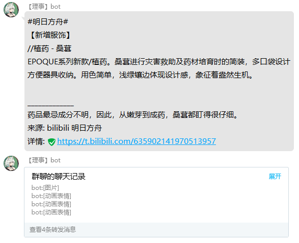

# 部署和使用

本节将教你快速部署和使用一个 nonebot-bison，如果你不知道要选择哪种部署方式，推荐使用[docker-compose](#docker-compose部署-推荐)

## 部署

本项目可以作为单独的 Bot 使用，可以作为 nonebot2 的插件使用

### 作为 Bot 使用

额外提供自动同意超级用户的好友申请和同意超级用户的加群邀请的功能

#### docker-compose 部署（推荐）

1. 在一个新的目录中下载[docker-compose.yml](https://raw.githubusercontent.com/felinae98/nonebot-bison/main/docker-compose.yml)  
   将其中的`<your QQ>`改成自己的 QQ 号
   ```bash
   wget https://raw.githubusercontent.com/felinae98/nonebot-bison/main/docker-compose.yml
   ```
2. 运行配置 go-cqhttp

   ```bash
   docker-compose run go-cqhttp
   ```

   通信方式选择：`3: 反向 Websocket 通信`  
   编辑`bot-data/config.yml`，更改下面字段：

   ```
   account: # 账号相关
     uin: <QQ号> # QQ账号
     password: "<QQ密码>" # 密码为空时使用扫码登录

   message:
     post-format: array

   ............

   servers:
     - ws-reverse:
         universal: ws://nonebot:8080/onebot/v11/ws/ # 将这个字段写为这个值
   ```

3. 登录 go-cqhttp
   再次
   ```bash
   docker-compose run go-cqhttp
   ```
   参考[go-cqhttp 文档](https://docs.go-cqhttp.org/faq/slider.html#%E6%96%B9%E6%A1%88a-%E8%87%AA%E8%A1%8C%E6%8A%93%E5%8C%85)
   完成登录
4. 确定完成登录后，启动 bot：
   ```bash
   docker-compose up -d
   ```

#### docker 部署

本项目的 docker 镜像为`felinae98/nonebot-bison`，可以直接 pull 后 run 进行使用，
相关配置参数可以使用`-e`作为环境变量传入

#### 直接运行（不推荐）

可以参考[nonebot 的运行方法](https://v2.nonebot.dev/guide/getting-started.html)
::: danger
直接克隆源代码需要自行编译前端，否则会出现无法使用管理后台等情况。
:::
::: danger
本项目中使用了 Python 3.9 的语法，如果出现问题，请检查 Python 版本
:::

1. 首先安装 poetry：[安装方法](https://python-poetry.org/docs/#installation)
2. clone 本项目，在项目中`poetry install`安装依赖
3. 安装 yarn，配置 yarn 源（推荐）
4. 在`admin-fronted`中运行`yarn && yarn build`编译前端
5. 编辑`.env.prod`配置各种环境变量，见[Nonebot2 配置](https://v2.nonebot.dev/guide/basic-configuration.html)
6. 运行`poetry run python bot.py`启动机器人

### 作为插件使用

本部分假设大家会部署 nonebot2

#### 手动安装

1. 安装 pip 包`nonebot-bison`
2. 在`bot.py`中导入插件`nonebot_bison`

### 自动安装

使用`nb-cli`执行：`nb plugin install nonebot_bison`

## 配置

可参考[源文件](https://github.com/felinae98/nonebot-bison/blob/main/src/plugins/nonebot_bison/plugin_config.py)

- `BISON_CONFIG_PATH`: 插件存放配置文件的位置，如果不设定默认为项目目录下的`data`目录
- `BISON_USE_PIC`: 将文字渲染成图片后进行发送，多用于规避风控
- `BISON_BROWSER`: 本插件使用 Chrome 来渲染图片
  - 使用 browserless 提供的 Chrome 管理服务，设置为`ws://xxxxxxxx`，值为 Chrome Endpoint（推荐）
  - 使用 cdp 连接相关服务，设置为`wsc://xxxxxxxxx`
  - 使用本地安装的 Chrome，设置为`local:<chrome path>`，例如`local:/usr/bin/google-chrome-stable`
  - 如果不进行配置，那么会在启动时候自动进行安装，在官方的 docker 镜像中已经安装了浏览器
    ::: warning
    截止发布时，本项目尚不能完全与 browserless 兼容，目前建议使用镜像内自带的浏览器，即
    不要配置这个变量
    :::
- `BISON_SKIP_BROWSER_CHECK`: 是否在启动时自动下载浏览器，如果选择`False`会在用到浏览器时自动下载，
  默认`True`
- `BISON_OUTER_URL`: 从外部访问服务器的地址，默认为`http://localhost:8080/bison`，如果你的插件部署
  在服务器上，建议配置为`http://<你的服务器ip>:8080/bison`
- `BISON_FILTER_LOG`: 是否过滤来自`nonebot`的 warning 级以下的 log，如果你的 bot 只运行了这个插件可以考虑
  开启，默认关
- `BISON_USE_QUEUE`: 是否用队列的方式发送消息，降低发送频率，默认开
- `BISON_RESEND_TIMES`: 最大重发次数，默认 0
- `BISON_USE_PIC_MERGE`: 是否启用多图片时合并转发（仅限群）
  - `0`: 不启用(默认)
  - `1`: 首条消息单独发送，剩余图片合并转发
  - `2`: 所有消息全部合并转发
  ::: details 配置项示例
  - 当`BISON_USE_PIC_MERGE=1`时:
  
  - 当`BISON_USE_PIC_MERGE=2`时:
  
  :::

## 使用

::: warning
本节假设`COMMAND_START`设置中包含`''`，如果出现 bot 不响应的问题，请先
排查这个设置
:::

### 命令

#### 在本群中进行配置

所有命令都需要@bot 触发

- 添加订阅（仅管理员和群主和 SUPERUSER）：`添加订阅`
- 查询订阅：`查询订阅`
- 删除订阅（仅管理员和群主和 SUPERUSER）：`删除订阅`

#### 私聊机器人获取后台地址

`后台管理`，之后点击返回的链接  
如果你是 superuser，那么你可以管理所有群的订阅；如果你是 bot 所在的群的其中部分群的管理，
你可以管理你管理的群里的订阅；如果你不是任意一个群的管理，那么 bot 将会报错。
::: tip
可以和 bot 通过临时聊天触发
:::
::: warning
网页的身份鉴别机制全部由 bot 返回的链接确定，所以这个链接并不能透露给别人。
并且链接会过期，所以一段时间后需要重新私聊 bot 获取新的链接。
:::

#### 私聊机器人进行配置（需要 SUPERUER 权限）

- 添加订阅：`管理-添加订阅`
- 查询订阅：`管理-查询订阅`
- 删除订阅：`管理-删除订阅`

### 所支持平台的 uid

#### Weibo

- 对于一般用户主页`https://weibo.com/u/6441489862?xxxxxxxxxxxxxxx`，`/u/`后面的数字即为 uid
- 对于有个性域名的用户如：`https://weibo.com/arknights`，需要点击左侧信息标签下“更多”，链接为`https://weibo.com/6279793937/about`，其中中间数字即为 uid

#### Bilibili

主页链接一般为`https://space.bilibili.com/161775300?xxxxxxxxxx`，数字即为 uid

#### RSS

RSS 链接即为 uid

#### 网易云音乐-歌手

在网易云网页上歌手的链接一般为`https://music.163.com/#/artist?id=32540734`，`id=`
后面的数字即为 uid

#### 网易云音乐-电台

在网易云网页上电台的链接一般为`https://music.163.com/#/djradio?id=793745436`，`id=`
后面的数字即为 uid
